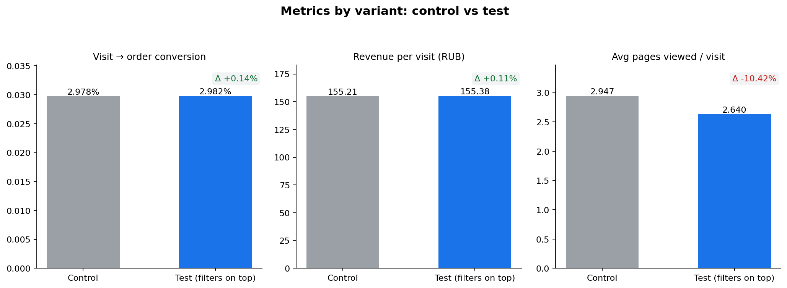
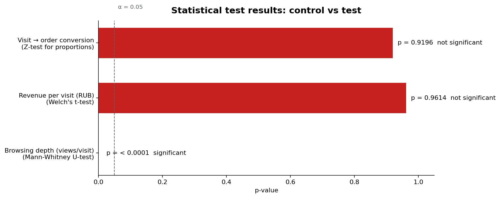

# A/B Test Analysis — Mobile Listing Redesign

> Take-home analysis of an A/B test on a travel marketplace's mobile activity-listing page. Primary objective: evaluate whether moving filters to the top of the listing drives a 7% lift in visit-to-order conversion. Includes statistical testing across primary, guardrail, and secondary metrics, plus product recommendations.

> 2024 · Solo · Take-home assignment for a data analyst role

## TL;DR

- **Test verdict: not a winner.** Visit-to-order conversion did not move significantly (p = 0.9196); revenue per visit also unchanged (p = 0.9614). The 7% conversion lift target was not met.
- **Guardrail: order quality didn't move either.** Conversion to *successful* order (excluding cancellations and pending) was directionally aligned with the primary metric — 1.62% control vs 1.56% test, a ~0.06pp drift well inside noise. No hidden upside hiding behind cancellations.
- **Secondary signal — filters did their job, but not where it counts.** Users in the test variant viewed ~10% fewer activity pages per visit at the same conversion rate (Mann-Whitney p < 0.0001). Fewer page-views with the same outcome reads as discovery becoming more efficient — users converged on a decision faster, the redesign didn't break anything, but it also didn't unlock new orders.
- **Statistical tests chosen by metric distribution:** Z-test for proportions (conversion), Welch's t-test (revenue per visit), Mann-Whitney U (skewed views distribution).
- **Recommendation:** do not roll out as-is. The conversion bottleneck is downstream of discovery (likely activity-card content, pricing, social proof, or the booking flow) — not in filter usability.

## Context

A travel marketplace ran an A/B test on its mobile activity-listing page. Hypothesis: **surfacing filters at the top of the listing helps users find activities more easily, increasing conversion by 7%**.

The experiment had three groups in the raw data:
- **Control** (`false`)
- **Test variant** (`growth_catalog_improving_navigation`) — filters moved to the top of the listing
- **Parallel test** (`true`) — an unrelated experiment running concurrently in the early period (an ABC structure during that window)

The primary control vs test comparison excludes the parallel `true` group.

## Data

Two visit-level and order-level CSV files (proprietary; not redistributed in this repo — see [data/README.md](data/README.md)):

**`ab_visits.csv`** — one row per visit:
- `visitor_token`, `visit_id`, `started_at`, `url`
- `feature_id`, `value`, `variation_id` — experiment assignment
- `views_amount` — page views on activity pages (`/ru/activities/`) during the visit

**`ab_orders.csv`** — one row per order:
- `order_id`, `visit_id`
- `state` — order lifecycle (`cleared`, `held`, `confirmed*`, `canceled*`, `pending`)
- `rub_fee` — platform commission in roubles

Cleaning steps (in [ab_test_analysis.ipynb](ab_test_analysis.ipynb)):
1. Aggregated 8,426 duplicate visit rows by `visit_id` (last `started_at`, summed `views_amount`).
2. Left-joined orders to visits; visits with no order get `rub_fee = 0`.
3. Defined `success = state ∈ {cleared, held}` for the guardrail rate.

## Methodology

### Metric design

| Metric | Type | Statistical test | Rationale |
|---|---|---|---|
| Visit → order conversion | Primary | Z-test for proportions | Binary outcome at visit level |
| Revenue per visit (`rub_fee`) | Guardrail | Welch's t-test | Continuous; captures conversion × order size jointly. Welch chosen over Student's t because variances likely differ between arms |
| Browsing depth (`views_amount`) | Secondary | Mann-Whitney U-test | Right-skewed, long-tail distribution; non-parametric test required |

The Mann-Whitney choice over a t-test for browsing depth was driven by distribution inspection: views per visit follow a long-tail pattern where a t-test's normality assumption doesn't hold. The boxplot in the notebook confirms the skew.

### Analysis approach

1. Joined orders to visits via `visit_id`; restricted analysis to control vs test (excluded the parallel `true` group).
2. Computed metrics per variant.
3. Ran an appropriate statistical test per metric distribution.
4. Inspected the views distribution visually (boxplot) to validate the non-parametric choice.
5. Translated statistical findings into product recommendations.

## Results




### Headline findings

| Metric | Control | Test | Δ (relative) | p-value | Significant? |
|---|---|---|---|---|---|
| Visit → order conversion | 2.978% | 2.982% | +0.14% | 0.9196 | No |
| Revenue per visit (RUB) | 155.21 | 155.38 | +0.11% | 0.9614 | No |
| Browsing depth (views/visit) | 2.947 | 2.640 | **−10.42%** | **< 0.0001** | **Yes** |

### Interpretation

- **Conversion and revenue did not move.** The relative deltas (+0.14% and +0.11%) are well inside noise, and the 7% target is not in the confidence interval. Treat as a confirmed null on the primary metric.
- **Conversion to *successful* order was checked as a sanity guardrail.** Filtering down to `state ∈ {cleared, held}` (i.e. excluding cancellations and pending bookings), the rates are 1.62% control vs 1.56% test — directionally aligned with the primary metric and showing no hidden upside masked by post-order cancellations. No formal test was run on this rate; the descriptive comparison is sufficient given the gap is smaller than the primary-metric noise floor.
- **Browsing depth dropped significantly.** Users in the test variant looked at roughly one fewer activity page per visit on average. Combined with the flat conversion, this reads as **discovery becoming more efficient**, not as users giving up — if filters had pushed users to bounce, conversion would likely have dropped too.
- **What this rules out:** "filters were too hard to find / too far down the page" is unlikely to be the conversion bottleneck. The redesign solved that problem. The bottleneck sits further along the funnel.

## Recommendations to product

1. **Do not roll out as-is.** The variant doesn't hit (or even approach) the 7% conversion lift target.
2. **Investigate the visit → activity-page → order funnel.** Browsing depth fell but orders didn't — instrument the steps in between (activity-page → add-to-cart, cart → checkout, checkout → payment) to find where users drop.
3. **Run the next UX test on the activity card itself**, not on filters — that's where the unanswered hypothesis sits. Photos, pricing presentation, reviews, host response time, availability calendar.
4. **Consider personalised recommendations** as an alternative discovery mechanism, especially for first-time visitors with thin intent signal — filter-driven discovery may not be the right paradigm for low-information sessions.

## Risks and limitations

- **Parallel experiment in the early window.** The concurrent `true` experiment overlapped with the test window. Pulling those visits out of the focal comparison is the right call but costs sample.
- **No site-wide guardrails.** Without revenue-per-visitor or LTV at the platform level, we cannot rule out cannibalisation (e.g. shifting orders between cohorts rather than creating new ones).
- **Browsing depth is directionally noisy.** Lower views with stable conversion is consistent with efficiency, but is not unambiguous proof — a session-replay or heatmap study would confirm.
- **Single-window observation.** Day-of-week and seasonality effects on a travel marketplace can be large; the test should ideally be run across a full weekly cycle and ideally a representative travel-demand window before final calls.
- **AOV proper not isolated.** The revenue-per-visit metric is `rub_fee` averaged across all visits (zeros included for non-converting visits) — useful as a joint guardrail but not a clean order-size measurement. A follow-up could split conversion and order size.

## Repository structure

```
ab_analysis/
├── README.md                      # You are here
├── ab_test_analysis.ipynb         # Full analysis notebook
├── data/                          # CSVs not redistributed (proprietary)
│   └── README.md
└── images/                        # Charts referenced in this README
    ├── metrics_by_variant.png
    └── p_values.png
```

## Tech stack

Python · pandas · NumPy · statsmodels · scipy · seaborn · matplotlib · Jupyter

## Author

**Mary Rymar** — Data Analyst
[LinkedIn](https://www.linkedin.com/in/rymarmary) · [GitHub](https://github.com/rymarmary)
